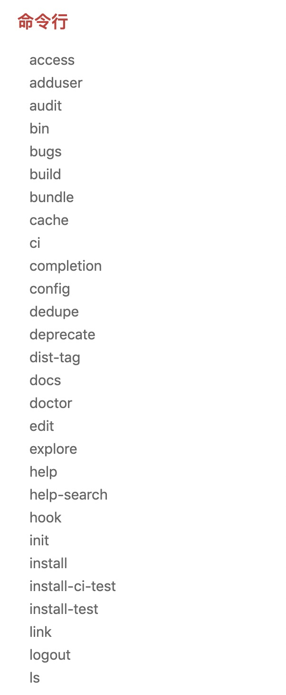

<!--
 * @Author: xiuquanxu
 * @Company: kaochong
 * @Date: 2020-03-08 13:38:07
 * @LastEditors: xiuquanxu
 * @LastEditTime: 2020-03-09 00:16:50
 -->
# 介绍  

工作过程中发现很多FE对于npm、npx、nvm、yarn区分了解的很少，而且对于一些命令不是很清楚作用，只知其一不知其二，本文主要带你真正了解他们的区别和作用。  

## npm  

无论什么知识，要想深入了解一定要去官网：<a href="https://www.npmjs.cn/getting-started/what-is-npm/">npm官网</a>  

npm是一个前端包管理工具，就像java中的maven一样，只需要简单配置(dependencies和devDependencies)npm就会自己去下载这些包。  

安装: npm是使用node写的，同时它也是node的包管理工具，当你安装了node以后实际上已经安装了npm只不过npm版本更新比node快所以如果你想更新npm的话可以通过如下命令：  
```
npm install npm@latest -g
```

npm常用命令:   

```
npm install (with no args, in package dir)
npm install [<@scope>/]<name>
npm install [<@scope>/]<name>@<tag>
npm install [<@scope>/]<name>@<version>
npm install [<@scope>/]<name>@<version range>
npm install <git-host>:<git-user>/<repo-name>
npm install <git repo url>
npm install <tarball file>
npm install <tarball url>
npm install <folder>

alias: npm i
common options: [-P|--save-prod|-D|--save-dev|-O|--save-optional] [-E|--save-exact] [-B|--save-bundle] [--no-save] [--dry-run]
```  

看到上面你可能比较疑惑毫无头绪，详细可以看<a href="https://www.npmjs.cn/cli/install/">npm install</a>，如果懒得看，我这里会讲解一些常用的。  

### 别名  
npm install = npm i

npm i 是npm install 别名

### 安装方式  

npm install test // 根据包名安装  

npm install test@test_2020_tag // 根据包名加版本号安装  

npm install test@1.0.0 // 根据指定版本安装  

npm install test@^1.0.0 // 根据版本一定范围安装,^代表的意思可以自行查询。  

上面的方式是我们常用的，接下来讲述一个不常用的，通过讲述这个例子你要学会**当一些问题没有头绪或者不知道怎么操作，记得一定要去官网找答案。**  

背景是这样的，我们组有一个SDK包，在对接时候另外一个同事要用，但是这个SDK包又不能放在npm上，因为比较关键不能泄露，也不能搭建一个私有的npm服务因为领导觉得比较费时，也不能发布到自己账号里设置成private，这样别人安装还要登录我的npm账号，最后无奈下我翻了一下官网发现可以通过npm install file的方式来安装npm包，最后使用了这个命令解决问题。  
```
npm install file:./test.tgz
```  

这样我每次把打包成一个tgz包，使用方自己就可以移动他项目里来安装了。  

### 安装参数  
npm install 如果什么参数也不加默认安装在dependecies下。

1. -S, --save: 包将会安装在dependecies下  

2. -D, --save-dev: 包将会安装在devDependencies下  

3. -g :安装在全局下  

例子:  
```
npm install packge --save = npm i package -S
npm install packge --save-dev = npm i package -D
```

这里可以学习一下node的模块管理，思考，为什么我们在全局安装的模块，在工程里面不安装却可以使用。这里实际上是node的包管理策略，它会在缓存中、node原生包、当前工程包以及全局包去有一个策略的搜索，这个不是本文重点内容，感兴趣可以看一下。  

### npm run  
```
npm run-script <command> [--silent] [-- <args>...]

alias: npm run
```
npm run实际上是npm run-script别名  

### 你不知道的npm命令  

这里你可以看到很多npm你不认识的命令，如果想了解点击上面官网。  

   

### package-lock.json  

package.json里面定义的是版本范围（比如^1.0.0），具体跑npm install的时候安的什么版本，要解析后才能决定，这里面定义的依赖关系树，可以称之为逻辑树（logical tree）。node_modules文件夹下才是npm实际安装的确定版本的东西，这里面的文件夹结构我们可以称之为物理树（physical tree）。安装过程中有一些去重算法，所以你会发现逻辑树结构和物理树结构不完全一样。package-lock.json可以理解成对结合了逻辑树和物理树的一个快照（snapshot），里面有明确的各依赖版本号，实际安装的结构，也有逻辑树的结构。其最大的好处就是能获得可重复的构建（repeatable build），当你在CI（持续集成）上重复build的时候，得到的artifact是一样的，因为依赖的版本都被锁住了。在npm5以后，其内容和npm-shrinkwrap.json一模一样。  

## npx  

<a href="https://www.npmjs.com/package/npx">地址</a>

NPM - 包管理工具，但是不能直接执行包，它更侧重于管理包。  
NPX - 一个执行node包的工具。  

当我们安装一个包eslint后，如果我们想单独运行这个包并获取版本号，使用eslint -v是不可以用的，如果你想执行可以有三种方式，一种通过全局安装npm i eslint -g,然后eslint -v, 另外一种找到对应的bin目录./node_modules/eslint/bin/eslint.js -v，最后一种通过package.json的script来执行。这三种要么依赖于全局要么比较繁琐，所以这里可以看出npm确实更偏向于包的管理，而对包的执行却没有那么友好。  

npx则可以单独执行包，当我们安装一个包eslint后，我们就直接可以通过npx eslint -v来执行了。当执行npx时候首先它会先看$path中有没有，如果没有就回去当前node_modules中查看，如果还没有就会安装。其实它优先类似于script标签的另外一种表达方式，因为它的能力可以通过package.json中script来实现。  

npx好处主要是避免全局安装，例如：$ npx create-react-app my-react-app  

这样安装后首先npx会创建下载一个临时的create-react-app然后新建一个my-react-app后就删除create-react-app，这样避免安装更多的node模块。


## nvm  

<a href="https://www.nvm-consultants.co.uk/">官网地址</a>

nvm实际上是node的版本管理工具，它的作用是允许你在电脑上同时安装多个node版本，通过nvm进行切换使用。

## yarn  

<a href="https://engineering.fb.com/web/yarn-a-new-package-manager-for-javascript/">官网地址</a>

官网定义：  

Yarn: A new package manager for JavaScript（yarn一个新的js包管理工具）  

出现一个新的工具肯定要弥补旧工具的缺点:  

npm缺点:  
1. 下载由于是串行所以下载慢   

2. 版本不固定  

```
"5.0.3",
"~5.0.3",
"^5.0.3"
```  

这样会导致可能官方发布了一个新版本导致两个人安装的时候实际上某个包的版本是不一样的，只不过大版本一样。  

3. npm安装过程中一个出错不会终止，会一直下载，最后将所有日志输出，导致日志杂乱。  

npx很好的解决了上述问题，下载上是并行下载提高下载速度，同时通过锁定版本可以解决版本固定问题，yarn输出更简洁。  

其实说了这么多，这节知识点只有一个yarm比npm好用很多。

## 参考  

> https://www.zhihu.com/question/62331583  
> https://www.npmjs.cn/  
> https://zhuanlan.zhihu.com/p/27449990
> https://www.ruanyifeng.com/blog/2019/02/npx.html

注：package-lock.json那节引自知乎用户：https://www.zhihu.com/people/coolgod 回答
