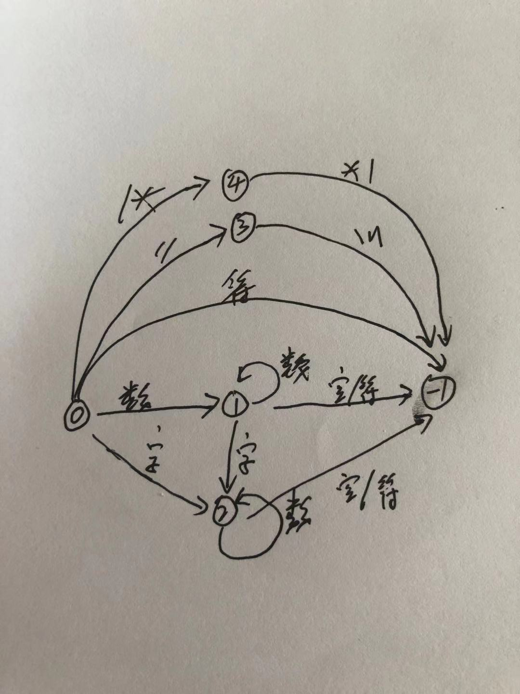

<!--
 * @Author: xiuquanxu
 * @Company: kaochong
 * @Date: 2021-04-10 15:40:08
 * @LastEditors: xiuquanxu
 * @LastEditTime: 2021-04-10 15:58:50
-->
## 前言  
最近在学编译原理，看了看龙书词法分析，根据自己的理解实现了一个简单的c的词法分析

## 设计  
我们通过状态图来描述词法分析程序，状态图如下：  
  

0状态代表初识状态，当从0状态输入空格时仍然处于0状态  

1状态是数字状态，当1状态输入还是数字那没仍处于1，如果输入是字符那么就变成2状态字符，如果输入是空格或者符号那么代表已经找到该token变为-1状态  

2状态是字符，当2状态输入数字或者字符时仍出于2状态，当输入空格或者符号那么已经找到token变为-1状态  

如果输入是符号状态(;{}()等)直接变成-1状态  

3状态是//这种注释状态，只有找到\n才会变成-1状态  

4状态是/\*这种注释，只有找到\*/这种符号才会变成-1状态  

-1状态是终止态，这个状态代表token可以获取到了  

## js版本实现  
```
/*
 * @Author: xiuquanxu
 * @Company: kaochong
 * @Date: 2021-04-08 23:39:49
 * @LastEditors: xiuquanxu
 * @LastEditTime: 2021-04-10 15:52:36
*/
// 简单的词法分析，将简单c语言通过状态图进行token分析  
const fs = require('fs');
// 读取c文件
const str = fs.readFileSync('./test.c', 'utf-8');
console.log(str, ' length:', str.length);
function lexer2(str) {
    let i = -1, state = 0;
    let symboalExpr = /[,;{}#<>()./]/;
    let numberExpr = /[0-9]/;
    let strExpr = /[a-zA-Z=]/;
    let spaceExpr = /[ \n]/;
    let nextLineExpr = /[\n]/;
    let preNote = '\/';
    let token = '', tokens = [], letter = ''; 
    function getChar() {
        i += 1;
        return str[i];
    }
    function getNext() {
        return str[i + 1];
    }
    function getLast() {
        return i == 0 ? str[0] : str[i - 1];
    }
    function back() {
        i -= 1;
    }
    function deleteTokenLastLetter() {
        let len = token.length;
        len > 0 ? token = token.substring(0, token.length - 1) : '';
    }
    function addToken() {
        tokens.push(token);
        token = '';
        state = 0;
    }
    while(i < str.length) {
        letter = getChar();
        token += letter;
        switch(state) {
            case 0:
                if (numberExpr.test(letter)) {
                    state = 1;
                } else if(strExpr.test(letter)) {
                    state = 2;
                } else if (symboalExpr.test(letter)) {
                    if (letter == preNote && getNext() == '\/') {
                        //  // 这种注释
                        state = 3;
                    } else if (letter == preNote && getNext() == '*') {
                        // /* 这种注释
                        state = 4;
                    } else {
                        state = -1;
                    }
                } else if (spaceExpr.test(letter)) {
                    deleteTokenLastLetter();
                    state = 0;
                } else {
                    console.log('state 0 miss');
                }
                break;
            case 1:
                if (numberExpr.test(letter)) {
                    state = 1
                } else if (strExpr.test(letter)) {
                    state = 2;
                } else if (symboalExpr.test(letter)) {
                    deleteTokenLastLetter();
                    back();
                    state = -1;
                } else if (spaceExpr.test(letter)) {
                    deleteTokenLastLetter();
                    state = -1;
                } else {
                    console.log('state 1 miss');
                }
                break;
            case 2:
                if (numberExpr.test(letter) || strExpr.test(letter)) {
                    state = 2;
                } else if (symboalExpr.test(letter)) {
                    deleteTokenLastLetter();
                    back();
                    state = -1;
                } else if (spaceExpr.test(letter)) {
                    deleteTokenLastLetter();
                    state = -1;
                } else {
                    console.log('state 2 miss');
                }
                break;
            case 3:
                if (nextLineExpr.test(letter)) {
                    state = -1;
                }
                break;
            case 4:
                if (letter == '\/' && getLast() == '*') {
                    state = -1;
                }
                break;
        }
        if (state == -1) {
            addToken();
         }
    } 
    console.log(tokens, i);
}

lexer2(str);
```

测试c文件:  
```
/*
 * @Author: xiuquanxu
 * @Company: kaochong
 * @Date: 2021-04-08 23:39:49
 * @LastEditors: xiuquanxu
 * @LastEditTime: 2021-04-10 15:10:17
*/
///vcxvxzvzvcxzvzx vxcvcxv xzcvzxcvzx vxczvzcxvczxv vxzcvz /*
#include <stdlib.h>
#include <stdio.h>

int main() {
    int a = 10;
    return 0;
}
```

输出:  

```
[
  '/*\n' +
    ' * @Author: xiuquanxu\n' +
    ' * @Company: kaochong\n' +
    ' * @Date: 2021-04-08 23:39:49\n' +
    ' * @LastEditors: xiuquanxu\n' +
    ' * @LastEditTime: 2021-04-10 15:10:17\n' +
    '*/',
  '///vcxvxzvzvcxzvzx vxcvcxv xzcvzxcvzx vxczvzcxvczxv vxzcvz /*\n',
  '#',
  'include',
  '<',
  'stdlib',
  '.',
  'h',
  '>',
  '#',
  'include',
  '<',
  'stdio',
  '.',
  'h',
  '>',
  'int',
  'main',
  '(',
  ')',
  '{',
  'int',
  'a',
  '=',
  '10',
  ';',
  'return',
  '0',
  ';',
  '}'
] 
```  

## 总结  
- 通过上面我们能大概了解到一个词法分析怎么做，首先要屡清楚各种状态转化，并画成图，确保图没有遗漏和错误地方，然后通过代码按照转换图一步一步实现。  
- 之前也实现过词法分析器但是都是通过大量if else去判断，通过状态图来写逻辑和编码都会清晰很多。  

## 地址  
持续更新自己学编译原理知识，所有demo都在这里（水平有限，希望大佬指点）。<a href="https://github.com/this-spring/bbaabbeell/tree/main/c2js">github</a>