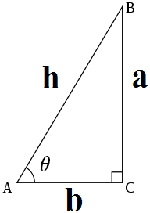
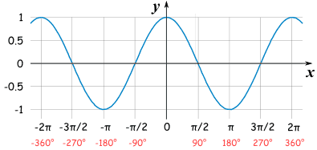
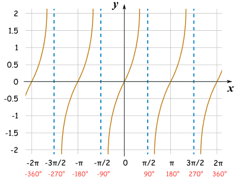

<!--
 * @Author: xiuquanxu
 * @Company: kaochong
 * @Date: 2021-01-04 14:14:47
 * @LastEditors: xiuquanxu
 * @LastEditTime: 2021-01-04 14:27:58
-->
## 三角函数定义  
在直角三角形中的定义，x角的对边、临边和斜边长度分别是a,b,h。那么sin、cos、tan定义如下：  
sin定义：sin = 对边 / 斜边 = a / h
cos定义：cos = 临边 / 斜边 = b / h
tan定义：tan = 对边 / 临边 = a / b  

  

## 图像  

sin:  
  

cos:  
  

tan:  
