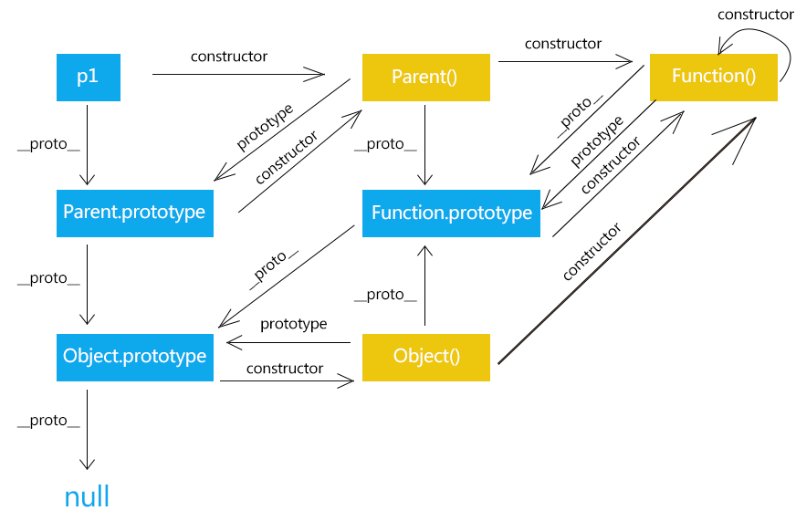
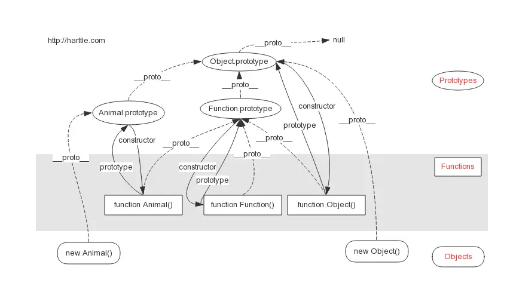

<!--
 * @Author: xiuquanxu
 * @Company: kaochong
 * @Date: 2020-12-08 15:38:40
 * @LastEditors: xiuquanxu
 * @LastEditTime: 2021-01-04 21:29:37
-->
## 基本类型  
最新的 ECMAScript 标准定义了 8 种数据类型:

7种原始类型：undefined, Null, boolean，number，string，bigint，symbol  
object  

NaN是nubmer类型  
NaN不等于NaN  
bigint:  
使用：  
- 数字后面加n，例如 2n
- 构造函数 BigInt(100)
由于js采用的IEEE-754存储标准，也就是双精度64位，小数存储的时候有效位只有52位，对应其他语言的float类型，所以导致他的精度范围在-(2^53 - 1) ~ (2^53 - 1)，这就导致超过这个值得整数进行运算就会出错，简单例子：  

```
99999999999999999 + 100 = 100000000000002000 // 浏览器会输出错误的数字  
```
这在银行领域或者其他数字精度要求比较高的领域会出现严重事故。   
出现这个问题的原因就是因为超过了js的精度范围。有了bigint就可以解决这个问题：  

```
99999999999999999n + 100n = 100000000000001999n // 浏览器会输出错误的数字  
```

Number.MAX_SAFE_INTEGER：js可以操作最大安全int  
Number.Min_SAFE_INTEGER：js可操作最小安全int  

Symbol  
定义：ES6 引入了一种新的原始数据类型Symbol，表示独一无二的值  
解决什么问题：当我们用第三方模块是如果想要向里面加入一个新属性很有可能导致key冲突，这个时候Symbol就可以解决这个问题。  
使用：Symbol([description])   
类型判断：typeof Symbol = symbol  

eg:  
```
定义：var x = {[Symbol('x')]: 1, [Symbol('x')]: 2}
取值：Object.getOwnPropertySymbols(x) // [Symbol(x), Symbol(x)]  

访问:  
var x = Symbol();
var obj = {
  x: '123'
  [x]: '456'
};
obj[x] // 456
obj['x'] // 123
<!-- 注意，Symbol 值作为对象属性名时，不能用点运算符。 -->
```    

作为属性名的时候遍历不会出现在：  
for...in、for...of循环中，也不会被Object.keys()、Object.getOwnPropertyNames()、JSON.stringify()返回。  

## for..of和for..in  
对于对象：  
```
var x = {name: 'xxq', age:'12'}
for (var k of x) {
  console.log(k);
}
<!-- VM340:1 Uncaught TypeError: x is not iterable -->  

for (var kk in x) {
  console.log(kk);
}
<!-- name, age-->
```  

for..in是遍历自身和继承的可枚举属性，不包括枚举和Symbol
key。被for..of遍历的对象需要有Symbol.Iterator接口。  
```
x[Symbol.iterator] = function() {return {next: function() {return {done: false, value:1}}}}  

<!-- 这种情况下在对x进行for..of遍历时候就不会报错且一直输出1 -->
```

## 类型检测  

### 1. typeof 输入一个原始数据反回一个字符串 : 可以检测出es5：undefined，number，boolean，string，function，object，es6：symbol，bigint  

undefined, Null, boolean，number，string，bigint，symbol  
object  

eg:  

```
注：  
typeof null -> "object"  
typeof Array -> "object"  
typeof NaN -> "number"  

```  

### 2. instanceof  返回值是boolean。检测左侧的原型链是否在右侧的原型上 

eg:  

```
[1,2] instanceof Array 返回 true  
new Object() instanceof Object 返回true
```  

手写instanceof  
```
function MyInstance(left, right) {
  while(left) {
    if (left.__proto__ === right.prototype) {
      return true;
    }
    left = left.__proto__;
  }
  return false;
}
```

### 3. Object.prototype.toString.apply: 返回字符串  
检测类型比较全面  
eg:  
```
Object.prototype.toString.apply(NaN)
"[object Number]"
Object.prototype.toString.apply(123);
"[object Number]"
Object.prototype.toString.apply('123');
"[object String]"
Object.prototype.toString.apply(true);
"[object Boolean]"
Object.prototype.toString.apply(null);
"[object Null]"
Object.prototype.toString.apply(undefined);
"[object Undefined]"
Object.prototype.toString.apply(new Object());
"[object Object]"
Object.prototype.toString.apply(1n);
"[object BigInt]"
Object.prototype.toString.apply(Symbol('ff'));
"[object Symbol]"
Object.prototype.toString.apply(() => {});
"[object Function]"
Object.prototype.toString.apply([]);
"[object Array]"
```  

## ES6相关  

### 字符串拓展  

#### 字符串模板  

```
const name = 'xiuquanxu';
const temp = `hello, my name is ${name}`;  
```  

### 函数拓展  

#### 函数参数的默认值  
ES6之前不能给给函数传默认参数
```
function log(name, age=12) {
    console.log(' name:', name, ' age:', age);
}
log('xxq');
// name:xx1 age:12
```  

#### rest参数  
ES6引入了rest参数（形式为...变量名），用于获取函数的多余参数，这样就不需要使用arguments对象了。  
```
function add(...values) {
    console.log(values); // [1,2,3]
    let sum = 0;
    for (var val of values) {
        sum += val;
    }
    return sum;
}
add(1,2,3);

static Arr2Str(...args) {
    const len = args.length;
    let str = `${DateFormatter.format(new Date())}`;
    for (let i = 0; i < len; i += 1) {
    str += ` ${args[i]}`;
    }
    return str;
}
```  

#### 严格模式  

规定只要函数参数使用了默认值、解构赋值、或者扩展运算符，那么函数内部就不能显式设定为严格模式，否则会报错。  

#### name属性  

这个属性很早就有了，但是直到ES6才被纳入标准。  

```
var f = function() {}
f.name // es5 null
f.name // f
```  

#### 箭头函数  

函数体内的this对象，就是定义时所在的对象，而不是使用时所在的对象。  

```  
eg1:  
function Timer() {
  this.s1 = 0;
  this.s2 = 0;
  // 箭头函数
  setInterval(() => this.s1++, 1000);
  // 普通函数
  setInterval(function () {
    this.s2++;
  }, 1000);
}

var timer = new Timer();

setTimeout(() => console.log('s1: ', timer.s1), 3100);
setTimeout(() => console.log('s2: ', timer.s2), 3100);
// s1: 3
// s2: 0
// 这个离职中s1使用箭头函数，所以this执行timer，s2是普通函数，执行this指向调用者也就是window

eg2:  

const cat = {
  lives: 9,
  jumps: () => {
    this.lives--;
  }
}

cat.jumps();
// NaN，由于箭头函数，此时指向定义时候的作用域，这个时候箭头函数定义在window下所以this.live为undefined -- 就是NaN  

eg3:  

var button = document.getElementById('press');
button.addEventListener('click', () => {
  this.classList.toggle('on');
});

// 此时click中的this由于是箭头函数指向定义时作用域，所以执向window。如果是function这个时候就是运行时执行调用的对象，所以就是执行button
```  

#### 函数参数和调用尾加逗号  

```
function clownsEverywhere(
  param1,
  param2,
) { /* ... */ }

clownsEverywhere(
  'foo',
  'bar',
);
```  

#### Function.prototype.toString()  

toString()方法，明确要求返回一模一样的原始代码  

```
function /* foo comment */ foo () {}

foo.toString()
// "function /* foo comment */ foo () {}"
```   

#### 二进制和八进制表示方法   

0b表示二进制  
0o表示八进制  
0x表示十六进制（并不是es6规定）  
eg:  
```
二进制1：0b1 === 1 // true
二进制3：0b11 === 3 // true  
八进制1： 0o1 === 1 // true
八进制9：0o11 === 9  // true
```

#### Number.isFinite()和Number.isNaN  

Number.isFinite:  判断是否数字有界限  
eg:
```
Number.isFinite(15); // true
Number.isFinite(0.8); // true
Number.isFinite(NaN); // false
Number.isFinite(Infinity); // false
Number.isFinite(-Infinity); // false
Number.isFinite('15'); // false
Number.isFinite(true); // false
```  

Number.isNaN:   判断是否是NaN  

eg:  
```
Number.isNaN(NaN) // true
Number.isNaN(15) // false
Number.isNaN('15') // false
Number.isNaN(true) // false
Number.isNaN(9/NaN) // true
Number.isNaN('true' / 0) // true
Number.isNaN('true' / 'true') // true
```  

相比较isFinite和isNaN：  
isFinite先调用Number()然后在判断，isNaN只判断里面的数是不是NaN。  
eg：  
```
Number.isFinite('15'); // false
isFinite('15') // true 
Number.isFinite(15); // false
isFinite('15') // true   

Number.isNaN(1 / 0); // true
isNaN(NaN); // true  
Number.isNaN(NaN) // true
```  

#### Number.parseInt(), Number.parseFloat()
原来这两个方法是全局方法，现在移植到了Number上，为了后面模块化管理。  

#### Number.isInteger()  
Number.isInteger()用来判断一个数值是否为整数。
JavaScript 内部，整数和浮点数采用的是同样的储存方法，所以 25 和 25.0 被视为同一个值。  

#### ES6 引入了Number.MAX_SAFE_INTEGER和Number.MIN_SAFE_INTEGER这两个常量  

#### ES6 引入BigInt  

### 数组拓展  

#### 方法  
map、filter、some、every、reduce、reduceRight

#### 1. 扩展运算符  
它好比 rest 参数的逆运算，将一个数组转为用逗号分隔的参数序列  
```
console.log(...[1, 2, 3])
// 1 2 3

console.log(1, ...[2, 3, 4], 5)
// 1 2 3 4 5

<!-- 减少for循环书写 -->
[...document.querySelectorAll('div')]
// [<div>, <div>, <div>]

<!-- 合并数组 -->
const arr = [1,2]
const arr1 = [3,4]
const arr2 = [...arr, ...arr1];
```   

#### 2. Array.from  
Array.from方法用于将两类对象转为真正的数组：类似数组的对象（array-like object）和可遍历（iterable）的对象  

```
let arrayLike = {
    '0': 'a',
    '1': 'b',
    '2': 'c',
    length: 3
};
let arr2 = Array.from(arrayLike); // ['a', 'b', 'c'];
<!-- 常用的是NodeList -->
const nl = document.querySelectorAll('p'); // NodeList
const arr = Array.from(document.querySelectorAll('p')); // Array
```

#### 3. Array.of  
Array.of方法用于将一组值，转换为数组。  
```
const arr = Array.of(1,2,3); // [1,2,3]
arr.length; // 3
```  

#### 4. Array.find()和Array.findIndex()  
返回数组中第一个符合条件的值   
返回数组中第一个符合条件的索引

```
const res = [1,2,3,-1].find((n) => {
  if (n < 0) return true;
  return false;
});
-1

<!-- findIndex -->  
const res = [1,2,3,-1].findIndex((n) => {
  if (n < 0) return true;
  return false;
});
-3
```
#### 5. 数组实例的 includes()  
返回一个boolean值，判断数组中是否包含该元素   
```
[1, 2, 3].includes(2)     // true
[1, 2, 3].includes(4)     // false
[1, 2, NaN].includes(NaN) // true
```

#### 6. flat   
返回一个被拉平后的新数组  
想要拉平多少层就传入参数多少例如：flat(2) // 拉平两层，
如果是无论多少层都拉平，那么就是，flat(Infinity)
```
const x = [1,2,[3,4]];
res = x.flat()
res // [1, 2, 3, 4]
x // [1,2,[3,4]]
```  

### 对象的拓展   

#### 1. 属性的简洁表示法  
属性名和值可以是同一个   
```
<!-- es5 -->
const x = 'woshixuxiuquan';
const obj = {
  x: x
}
<!-- es6 -->  
const obj = {
  x,
}

```  

####  2. 可枚举性  
对象的每个属性都有一个描述对象（Descriptor），用来控制该属性的行为。Object.getOwnPropertyDescriptor方法可以获取该属性的描述对象。  

注：注意区分property和prototye。property是属性，prototype是原型链。  

```
let obj = { foo: 123 };
Object.getOwnPropertyDescriptor(obj, 'foo')
//  {
//    value: 123,
//    writable: true,
//    enumerable: true,
//    configurable: true
//  }
<!-- 解释 -->
value
该属性的值(仅针对数据属性描述符有效)  
writable
当且仅当属性的值可以被改变时为true。(仅针对数据属性描述有效)
get
获取该属性的访问器函数（getter）。如果没有访问器， 该值为undefined。(仅针对包含访问器或设置器的属性描述有效)
set
获取该属性的设置器函数（setter）。 如果没有设置器， 该值为undefined。(仅针对包含访问器或设置器的属性描述有效)
configurable
当且仅当指定对象的属性描述可以被改变或者属性可被删除时，为true。
enumerable
当且仅当指定对象的属性可以被枚举出时，为 true。  

尽量不要用for...in循环，而用Object.keys()代替
```  

#### 3. 属性的遍历  
for in  // 遍历自身和继承的可枚举属性，不包括枚举和Symbol  
Object.keys() // 遍历自身可枚举属性，不包括继承和Symbol  
Object.getOwnPropertyNames(obj) // 遍历所有可枚举和不可枚举，不包括Symbol  
Object.getOwnPropertySymbols(obj) // 遍历所有Symbol属性  
Reflect.ownKeys(obj) // 遍历所有的键名，包括Symbol和继承  

以上的 5 种方法遍历对象的键名，都遵守同样的属性遍历的次序规则。

- 首先遍历所有数值键，按照数值升序排列。
- 其次遍历所有字符串键，按照加入时间升序排列。
- 最后遍历所有 Symbol 键，按照加入时间升序排列。  

#### 4. super关键字  
this指向当前对象，super执行当前对象的原型对象。super只能用在对象方法之中用在其他地方会报错。super使用时等价于Object.getPrototypeOf(this).foo  

```
const temp = {
  foo: 'tempfoo'
};
const obj = {
  foo: 'objfoo',
  find() {
    return super.foo;
  }
}
Object.setPrototypeOf(obj, temp);
console.log(obj.find());

// 报错
const obj = {
  foo: super.foo
}

// 报错
const obj = {
  foo: () => super.foo
}

// 报错
const obj = {
  foo: function () {
    return super.foo
  }
}
```  

#### ES2020 引入了“链判断运算符”  

```
// 错误的写法
const  firstName = message.body.user.firstName;

// 正确的写法
const firstName = (message
  && message.body
  && message.body.user
  && message.body.user.firstName) || 'default';

<!-- es2020 正确写法 -->  
const firstName = message?.body?.user?.firstName || 'default';

```


### 对象拓展方法  

#### Object.is()  

es5时，==会默认进行类型转换，===判断时候会导致NaN !== NaN。所以Object.is表现和===表现一直，但是他的NaN是等于NaN的。+0和-0是不相等的。  
```
Object.is(NaN, NaN); // true
Object.is(0, 1); // false
Object.is(0, -0); // false
Object.is(+0, -0); // false
Object.is(1, '1'); // false
```  

#### Object.assign()  

Object.assign()方法用于对象的合并，将源对象（source）的所有**可枚举，Symbol也可以**属性（只拷贝源对象的自身属性（不拷贝继承属性），也不拷贝不可枚举的属性），复制到目标对象（target）,并返回目标对象（和目标对象是一个引用）。  
Object.assign(target, source1, source2...);

```
const target = { a: 1 };

const source1 = { b: 2 };
const source2 = { c: 3 };

const res = Object.assign(target, source1, source2);
<!-- res和target指向的是一个引用 -->
target // {a:1, b:2, c:3}
```  

#### __proto__  

这个api是一个不建议使用的Api，因此，无论从语义的角度，还是从兼容性的角度，都不要使用这个属性，而是使用下面的Object.setPrototypeOf()（写操作）、Object.getPrototypeOf()（读操作）、Object.create()（生成操作）代替。  

#### Object.setPrototypeOf()和Object.getPrototypeOf()   


#### ES2017 引入了跟Object.keys配套的Object.values和Object.entries，作为遍历一个对象的补充手段，供for...of循环使用   

### Symbol  

### Set和Map  

### Reflect  

目的：  

- 将Object对象的一些明显属于语言内部方法放在Reflect上。例如：Object.defineProperty。现阶段Object和Reflect上都会共存语言内部方法，但是后面会全部转移到Reflect上。  

- 修改某些Object方法返回结果，例如之前Object.defineProperty在无法定义属性时会抛出一个错误，而Reflect.defineProperty则会放回false。  
```
// 老写法
try {
  Object.defineProperty(target, property, attributes);
  // success
} catch (e) {
  // failure
}

// 新写法
if (Reflect.defineProperty(target, property, attributes)) {
  // success
} else {
  // failure
}
```
- Object某些命令式Api变得函数式  

```
// 老写法
'assign' in Object // true

// 新写法
Reflect.has(Object, 'assign') // true
```  

静态方法：  

- Reflect.apply(target, thisArg, args)
- Reflect.construct(target, args)
- Reflect.get(target, name, receiver)
- Reflect.set(target, name, value, receiver)
- Reflect.defineProperty(target, name, desc)
- Reflect.deleteProperty(target, name)
- Reflect.has(target, name)
- Reflect.ownKeys(target)
- Reflect.isExtensible(target)
- Reflect.preventExtensions(target)
- Reflect.getOwnPropertyDescriptor(target, name)
- Reflect.getPrototypeOf(target)
- Reflect.setPrototypeOf(target, prototype)  

### Promise  

注：面试题（手写promise，promise和setTimeout等执行顺序）

Promise  

```
原型上的方法：  
let p = new Promise();
p.then(),p.catch(),p.finally()  

构造函数上的方法：  
Promise.all([p1,p2...]);  
Promise.race([p1,p2...]);
Promise.any([p1,p2...]);
Promise.reject();
Promise.resolve();
```

一种异步编程解决方案  
特点：
1. 三种状态pending(进行中)，fulfilled(已成功，rejected(以失败)。  
2. 状态只可能从pending->fulfilled和pending->rejected，一旦状态改变就不可能再变了。  

缺点：  
1. 无法取消，一旦开始就无法取消  
2. 如果不设置回调函数，内部出错不会反映到外部  

#### 原型上的方法（Promise.prototye.then,Promise.prototype.catch,Promise.prototype.finally）  
注意finally无论什么时候都会执行，但是不带有任何参数，所以在finally中处理的一定是跟状态无关的操作。
#### Promise.all([p1,p2,p3])  

输入不一定是数组只要是一个具有Interator数组就可以，输出两种情况，如果全部成功则resolved，如果其中有一个失败则输出rejected。  

eg:  
```
const resPromiseAll = [1,2,3].map((id) => {
  return http(`http://xxxx?id=${id}`);
})

Promise.all(reqPromiseAll).then((res) => {
  console.log('全部成功');
}).catch((error) => {
  console.log('有一个失败');
})
```

#### Promise.race([p1,p2,p3])  
输入不一定是数组只要是一个具有Interator数组就可以，输出率先执行完（无论成功还是失败）操作的promise。  
```
const p = Promise.race([
  fetch('/resource-that-may-take-a-while'),
  new Promise(function (resolve, reject) {
    setTimeout(() => reject(new Error('request timeout')), 5000)
  })
]);

p
.then(console.log)
.catch(console.error);
```  

#### (new Promise()).then(() => , () => {}).catch 第二个then和catch区别  

1. 当错误在promise中发生时，会就近原则，如果第二个then和catch同时存在那么就只有第二个then执行。如果只有catch存在那么就只执行cath  
2. 当错误在resolve中发生时异常是，那么第二个then就不会接收到错误，而cath却可以。所以我们建议使用catch，一方面它捕获错误最全面，另外一个方面更接近try catch写法  

第二个then方法就是reject执行时的回调。

#### Promise.any([p1,p2,p3]) Es2021  

其中只要有一个变成fulfilled，Promise.any()返回的 Promise 对象就变成fulfilled。如果所有三个操作都变成rejected，那么await命令就会抛出错误。  

```
try {
  const first = await Promise.any(promises);
  // Any of the promises was fulfilled.
} catch (error) {
  // All of the promises were rejected.
}

Promise.any(promises).then(
  (first) => {
    // Any of the promises was fulfilled.
  },
  (error) => {
    // All of the promises were rejected.
  }
);
```  

```
var resolved = Promise.resolve(42);
var rejected = Promise.reject(-1);
var alsoRejected = Promise.reject(Infinity);

Promise.any([resolved, rejected, alsoRejected]).then(function (result) {
  console.log(result); // 42
});

Promise.any([rejected, alsoRejected]).catch(function (results) {
  console.log(results); // [-1, Infinity]
});
``` 

对于Promise.resolve(x)和Promise.reject(x)如果x是一个值那么会被包装成promise返回回去，如果是一个promise则直接返回。  
```
Promise.resolve(1).then((x) => {
  console.log(x);//1
})
<!-- Promise.resolve() // Promise {<fulfilled>: undefined}
 -->
```

面试题：  
```
题目一：  
const promise = new Promise((resolve, reject) => {
    console.log(1)
    resolve()
    console.log(2)
})
promise.then(() => {
    console.log(3)
})
console.log(4)

题目二： 
var promise = new Promise(function(resolve, reject){
  setTimeout(function() {
    resolve(1);
  }, 3000)
})
// 1
promise.then(() => {
  return Promise.resolve(2);
}).then((n) => {
  console.log(n)
});

// 2
promise.then(() => {
  return 2
}).then((n) => {
  console.log(n)
});

// 3
promise.then(2).then((n) => {
  console.log(n)
});

题目三：
let a;
const b = new Promise((resolve, reject) => {
  console.log('promise1');
  resolve();
}).then(() => {
  console.log('promise2');
}).then(() => {
  console.log('promise3');
}).then(() => {
  console.log('promise4');
});

a = new Promise(async (resolve, reject) => {
  console.log(a);
  await b;
  console.log(a);
  console.log('after1');
  await a
  resolve(true);
  console.log('after2');
});

console.log('end');

题目四：
const promise = new Promise((resolve, reject) => {
  resolve('success1');
  reject('error');
  resolve('success2');
});

promise
  .then((res) => {
    console.log('then: ', res);
  })
  .catch((err) => {
    console.log('catch: ', err);
  });

题目五：
Promise.resolve()
  .then(() => {
    return new Error('error!!!')
  })
  .then((res) => {
    console.log('then: ', res)
  })
  .catch((err) => {
    console.log('catch: ', err)
  })
题目六：
手写promise
```

### Iterator和for...of循环   

Iterator出现的意义：原有的对象结构包括了，set，map，obj，array。Iterator（遍历器）是一种接口，为各种不同的数据结构提供统一的访问机制。任何数据结构只要部署了Iterator接口，就可以完成便利操作（依次遍历所有成员）。  

默认的 Iterator 接口部署在数据结构的Symbol.iterator属性

原生具备Iterator接口的数据结构：  

- Array
- Map
- Set
- String
- TypedArray
- 函数的 arguments 对象
- NodeList 对象  

对象（Object）之所以没有默认部署 Iterator 接口，是因为对象的哪个属性先遍历，哪个属性后遍历是不确定的，需要开发者手动指定。本质上，遍历器是一种线性处理，对于任何非线性的数据结构，部署遍历器接口，就等于部署一种线性转换。不过，严格地说，对象部署遍历器接口并不是很必要，因为这时对象实际上被当作 Map 结构使用，ES5 没有 Map 结构，而 ES6 原生提供了。

一个对象如果要具备可被for...of循环调用的 Iterator 接口，就必须在Symbol.iterator的属性上部署遍历器生成方法（原型链上的对象具有该方法也可）  

使用：  

```
<!-- 1. 解构赋值 -->  
let set = new Set().add('a').add('b').add('c');

let [x,y] = set;
// x='a'; y='b'

let [first, ...rest] = set;

<!-- 2. 拓展运算符 -->
var str = 'hello';
[...str] // ['h', 'e', 'l', 'l', 'o']
```  

### Generator语法  

Generator 函数是 ES6 提供的一种异步编程解决方案  
定义：function* fnc_name() {
    yield x;
    yield y;
    return z;
}  

使用：var x = fnc_name();  // 返回的是Iterator迭代器（{value:'xx', done: false}）  
x.next(); { value: 'x', done: false }  
x.next(); { value: 'y', done: false }  
x.next(); { value: 'z', done: true }  
每次调用next都会去执行上次Iterator的指针位置加一那部分代码。  

#### next中传入参数  
next传参作为上次yield的返回结果   
```
function* a() {
  let flag = false;
  flag = yield 1;
  yield flag ? 2 : 0;
  return -1;
}
var aa = a();
aa.next(); { value: 1, done: false }
aa.next(true); { value:  2, done: false}
```

#### for...of循环  
for...of循环可以自动遍历 Generator 函数运行时生成的Iterator对象，且此时不再需要调用next方法。  

```
function* foo() {
  yield 1;
  yield 2;
  yield 3;
  yield 4;
  yield 5;
  return 6;
}

for (let v of foo()) {
  console.log(v);
}
// 1 2 3 4 5
```   

#### Gernerator.prototype.throw()  
Generator 函数返回的遍历器对象，都有一个throw方法，可以在函数体外抛出错误，然后在 Generator 函数体内捕获。

```
var g = function* () {
  try {
    yield;
  } catch (e) {
    console.log('内部捕获', e);
  }
};

var i = g();
i.next();

try {
  i.throw('a');
  i.throw('b');
} catch (e) {
  console.log('外部捕获', e);
}
// 内部捕获 a
// 外部捕获 b
```  

#### Gernerator.prototype.return()  
Generator 函数返回的遍历器对象，还有一个return()方法，可以返回给定的值，并且终结遍历 Generator 函数。  

```
function* gen() {
  yield 1;
  yield 2;
  yield 3;
}

var g = gen();

g.next()        // { value: 1, done: false }
g.return('foo') // { value: "foo", done: true }
g.next() 
```  

#### yield*表达式  
在generator中调用另外一个generator

```
function* bar() {
  yield 'x';
  yield* foo();
  yield 'y';
}

// 等同于
function* bar() {
  yield 'x';
  yield 'a';
  yield 'b';
  yield 'y';
}

// 等同于
function* bar() {
  yield 'x';
  for (let v of foo()) {
    yield v;
  }
  yield 'y';
}

for (let v of bar()){
  console.log(v);
}
// "x"
// "a"
// "b"
// "y"
```  

#### Generator函数的this  

Generator函数总是返回一个**遍历器**，ES6规定返回的这个遍历器就是Generator得实例，继承原型链上的方法。  
```
function* g() {}

g.prototype.hello = function () {
  return 'hi!';
};

let obj = g();

obj instanceof g // true
obj.hello() // 'hi!'
```  

如果把g当作普通的构造函数，并不会生效，因为g返回的总是遍历器对象，而不是this对象。  

```
function* g() {
  this.a = 11;
}

let obj = g();
obj.next();
obj.a // undefined
```  

Generator不能跟new一起使用  

#### Generator与状态机  
它是实现状态机最佳结构  
```
var clock = function* () {
  while (true) {
    console.log('Tick!');
    yield;
    console.log('Tock!');
    yield;
  }
};

var c = clock();
c.next(); // tick
c.next(); // tock
c.next(); // tick
....
```  

#### Generator与携程  
最大的优势就是协程极高的执行效率。因为子程序切换不是线程切换，而是由程序自身控制，因此，没有线程切换的开销，和多线程比，线程数量越多，协程的性能优势就越明显。

第二大优势就是不需要多线程的锁机制，因为只有一个线程，也不存在同时写变量冲突，在协程中控制共享资源不加锁，只需要判断状态就好了，所以执行效率比多线程高很多。  

由于 JavaScript 是单线程语言，只能保持一个调用栈。引入协程以后，每个任务可以保持自己的调用栈。这样做的最大好处，就是抛出错误的时候，可以找到原始的调用栈。不至于像异步操作的回调函数那样，一旦出错，原始的调用栈早就结束。

### Generator的应用  

#### 异步编程  
- 回调函数  
- 事件监听 
- 发布订阅
- Promise  
- Generator  

#### callback && promise && await-async && generator  

**详细见FE下5**  

#### Generator函数关键特点  

1. 通过next(....)可以向生成器中注入参数  
2. 通过yield xxx;可以向外部返回参数(value: xxx, done: false)  
3. 出错处理（外部抛出错误，内部可以处理）  

```
<!-- 出错处理例子 -->
function* gen(x){
  try {
    var y = yield x + 2;
  } catch (e){
    console.log(e);
  }
  return y;
}

var g = gen(1);
g.next();
g.throw('出错了');  

Generator 函数体外，使用指针对象的throw方法抛出的错误，可以被函数体内的try...catch代码块捕获。这意味着，出错的代码与处理错误的代码，实现了时间和空间上的分离，这对于异步编程无疑是很重要的。
```  

#### 真实的异步封装  

```
function* req() {
    var res = yield fetch('https://api.github.com/users/github');
    console.log(` 获取到blog地址：${res.blog}`);
    return true;
}

const rr = req();
const promiseFetch = rr.next();
promiseFetch.value.then((res) => res.json()).then((res) => {
    rr.next(res);
});

上面的例子在Generator中语义上非常贴近同步执行，如果去掉yield那么就是一个程序同步执行的过程。  
执行上首先通过yield拿到返回的promise然后在外面处理完res之后通过next函数返还给req，把数据交个req处理。
```  

### async  

async是generator的语法糖

```
<!-- await实现休眠 -->  
function Sleep(time) {
    return new Promise((resolve, reject) => {
        setTimeout(() => {
            resolve();
        }, time);
    });
}

async function test() {
    for(let i = 0; i < 5; i += 1) {
        await Sleep(i * 1000);
        console.log(i);
    }
}
```  

### class  

#### 继承
es5:  


es6:  

#### Object.getPrototypeOf()   

可以使用这个方法判断，一个类是否继承了另一个类。  

#### super  

第一种：super作为函数调用时，代表父类的构造函数

第二种情况：super作为对象时，在普通方法中，指向父类的原型对象；在静态方法中，指向父类。   
```
class A {
  constructor() {
    this.p = 2;
  }
}

class B extends A {
  get m() {
    return super.p;
  }
}

let b = new B();
b.m // undefined
```

第三种：ES6 规定，在子类普通方法中通过super调用父类的方法时，方法内部的this指向当前的子类实例。

```
class A {
  constructor() {
    this.x = 1;
  }
  print() {
    console.log(this.x);
  }
}

class B extends A {
  constructor() {
    super();
    this.x = 2;
  }
  m() {
    super.print();
  }
}

let b = new B();
b.m() // 2
```  

#### 原生构造函数  

- Boolean()
- Number()
- String()
- Array()
- Date()
- Function()
- RegExp()
- Error()
- Object()  

以前，这些原生构造函数是无法继承的，比如，不能自己定义一个Array的子类。

ES6 可以自定义原生数据结构（比如Array、String等）的子类，这是 ES5 无法做到的。  

```
class VersionedArray extends Array {
  constructor() {
    super();
    this.history = [[]];
  }
  commit() {
    this.history.push(this.slice());
  }
  revert() {
    this.splice(0, this.length, ...this.history[this.history.length - 1]);
  }
}

var x = new VersionedArray();

x.push(1);
x.push(2);
x // [1, 2]
x.history // [[]]

x.commit();
x.history // [[], [1, 2]]

x.push(3);
x // [1, 2, 3]
x.history // [[], [1, 2]]

x.revert();
x // [1, 2]

```  

#### Mixin 模式的实现  

Mixin 指的是多个对象合成一个新的对象，新对象具有各个组成成员的接口。它的最简单实现如下。

```
const a = {
  a: 'a'
};
const b = {
  b: 'b'
};
const c = {...a, ...b}; // {a: 'a', b: 'b'}
```

下面是一个更完备的实现，将多个类的接口“混入”（mix in）另一个类。  

```
面是一个更完备的实现，将多个类的接口“混入”（mix in）另一个类。

function mix(...mixins) {
  class Mix {
    constructor() {
      for (let mixin of mixins) {
        copyProperties(this, new mixin()); // 拷贝实例属性
      }
    }
  }

  for (let mixin of mixins) {
    copyProperties(Mix, mixin); // 拷贝静态属性
    copyProperties(Mix.prototype, mixin.prototype); // 拷贝原型属性
  }

  return Mix;
}

function copyProperties(target, source) {
  for (let key of Reflect.ownKeys(source)) {
    if ( key !== 'constructor'
      && key !== 'prototype'
      && key !== 'name'
    ) {
      let desc = Object.getOwnPropertyDescriptor(source, key);
      Object.defineProperty(target, key, desc);
    }
  }
}

<!-- 使用 -->
class DistributedEdit extends mix(Loggable, Serializable) {
  // ...
}
```  

### AMD、CommonJS和ES6 Module(import,export)  


### 一个js对象完整的原型链   


function Person() {

}
var person = new Person();
console.log(person.constructor === Person); // true  
这里的personr.constructor如果访问不到，回去原型上找

  
  


面试题:  

```
题目一：
Function.prototype.a = () => {
  console.log(1);
}
Object.prototype.b = () => {
  console.log(2);
}
function A() {}
const a = new A();

a.a();
a.b();
A.a();
A.b();  

题目二：
function A() {
}

A.prototype.n = 0;

A.prototype.add = function () {
  this.n += 1;
}

a = new A();
b = new A();
a.add();
console.log(b.add())

题目三：
function Person(name, age) {
  this.name = name;
  this.age = age;
  this.eat = function() {
    console.log(age + "岁的" + name + "在吃饭。");
  }
}

Person.run = function () {}
Person.prototype.walk = function () {}

let p1 = new Person("jsliang", 24);
let p2 = new Person("jsliang", 24);

console.log(p1.eat === p2.eat); // false
console.log(p1.run === p2.run); // true
console.log(p1.walk === p2.walk); // true

题目四：
function A() {
  this.test = 1
}

var a = new A();
a.test

a = new A;
a.test

a = A()
a.test

A.test

题目五：
function A() {}
function B(a) {
    this.a = a;
}
function C(a) {
    if (a) {
        this.a = a;
    }
}
A.prototype.a = 1;
B.prototype.a = 1;
C.prototype.a = 1;

console.log(new A().a); // 1
console.log(new B().a); // undefined
console.log(new C(2).a); // 2

题目六：
function foo() {
    this.some = '222'
    let ccc = 'ccc'
    foo.obkoro1 = 'obkoro1'
    foo.prototype.a = 'aaa'
}
foo.koro = '扣肉'
foo.prototype.test = 'test'
let foo1 = new foo() 
foo.prototype.test = 'test2'
```  

### defer和async  

defer和async共同点是普通脚本会被并行请求，并尽快解析和执行，不会阻塞下面的解析。  
不同点：  
async：遇到就开始下载，下载完后就执行，跟dom执行顺序没有关系。如果多个脚本不区分脚本写的先后顺序。
defer：遇到就开始下载，将在文档完成解析后，触发 DOMContentLoaded 事件前执行。如果有多个脚本，那么写的什么顺序就会按照什么顺序执行，无论下载快慢。  

<script type="module"></script> // 表现和defer一样同样不会阻塞dom解析  

淘宝首页：全是async  
defer：defer 用于需要整个 DOM 的脚本，和/或脚本的相对执行顺序很重要的时候  

### 几种框架常用API  
for...in  


for...of  


obj.hasOwnProperty(prop)  

Object.getOwnPropertyDescriptor(target, prop);  

Object.getOwnPropertyNames(property);