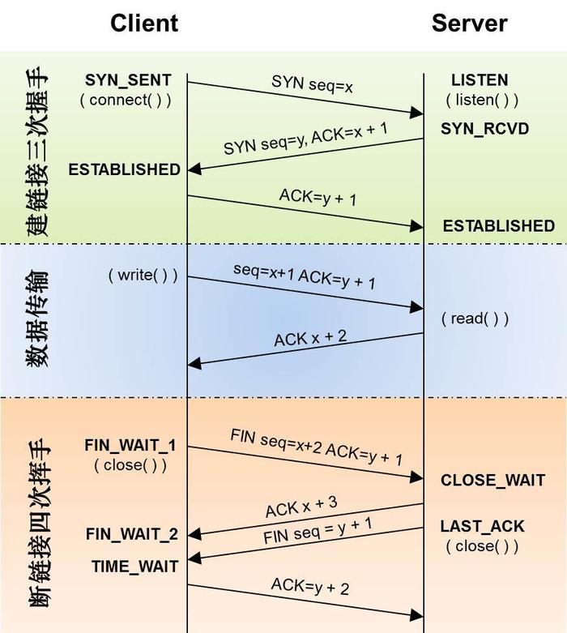

<!--
 * @Author: xiuquanxu
 * @Company: kaochong
 * @Date: 2020-12-06 20:12:00
 * @LastEditors: xiuquanxu
 * @LastEditTime: 2021-04-10 23:33:14
-->

## XSS和CSRF  

CSRF(Cross-site request forgery)跨站请求伪造过程: 用户C首先请求网站A进行登录操作，此时C在A网站处于登录状态，这个时候用户C打开网站B（攻击者），B网站埋有恶意代码请求A，这个时候请求会携带上A的cookie，由于C在A中有登陆状态所以B请求A的操作会顺利执行，达到攻击的目的。  

防范：  
- token验证
- Referer 验证：只接受本站请求  

XSS(Cross-Site Scripting)跨站脚本攻击：通过把恶意脚本存储在数据库、拼接到URL、拼接到dom中，这几种方式达到恶意攻击的目的。例如当一个用户在网站A中评论模块嵌入一段无限alter代码，当B访问的时候（服务端渲染）就会执行这段代码，导致一直alter。  

xss分类：  
- 存储型：恶意代码被提交到数据库，当用户访问时，服务端取出代码拼接在html中然后恶意代码得到执行，导致攻击。常见用户评论等
- 反射型：恶意代码被拼接在url中，当服务端获取的url参数之后，会拼接恶意代码返回给浏览器，恶意代码通过伪造链接等方式诱导用户点击，用户点击后达到攻击的目的。常见搜索，网站跳转。  
- dom型：恶意代码被拼接在例如innerHtml这种dom api中。例如：当请求一个接口然后把内容渲染在里面利用innerHTML就会让这段恶意代码得到执行。

反射型 XSS 跟存储型 XSS 的区别是：存储型 XSS 的恶意代码存在数据库里，反射型 XSS 的恶意代码存在 URL 里。

防范：  
- 存储类：改成纯前端渲染，把代码和数据分隔开。
- 反射类：对 HTML 做充分转义。
- dom类：在使用 .innerHTML、.outerHTML、document.write() 时要特别小心，不要把不可信的数据作为 HTML 插到页面上，而应尽量使用 .textContent、.setAttribute() 等。

## cookie，session，localStorege、sessionStorage  

cookie: 服务端通过http报文设置cookie，也就是响应头Set-Cookie(Set-Cookie: "name=value;domain=.domain.com;path=/;expires=Sat, 11 Jun 2019 11:29:42 GMT;HttpOnly;secure")，cookie如果设置了http-only的话，告知浏览器不允许通过脚本document.cookie去更改这个值，同样这个值在document.cookie中也不可见。但在http请求张仍然会携带这个cookie。大小一般是4k。  

localStore大小4m

## http缓存  

强制：  
http1.0: Pragma  
http1.1: Expires  
http1.1: Cache-Control  

eg:  
```
Pragma: no-cache  
Expires: Wed, 21 Oct 2015 07:28:00 GMT
Cache-Control: max-age=280000
```

协商缓存：  
req: If-Modified-Since res: Last-Modified  
req: If-None-Match res:Etag

<a href="https://zhuanlan.zhihu.com/p/114574039">地址</a>  

## tcp三次握手四次挥手  
  

报文格式：  

- 序号：Seq序号，占32位，用来标识从TCP源端向目的端发送的字节流，发起方发送数据时对此进行标记。
- 确认序号：Ack序号，占32位，只有ACK标志位为1时，确认序号字段才有效，Ack=Seq+1。
- 标志位：共6个，即URG、ACK、PSH、RST、SYN、FIN等，具体含义如下：（A）URG：紧急指针（urgent pointer）有效。（B）ACK：确认序号有效。（C）PSH：接收方应该尽快将这个报文交给应用层。（D）RST：重置连接。（E）SYN：发起一个新连接。（F）FIN：释放一个连接。

握手：
- 1. C发送SYN seq=x给S  
- 2. S返回ACK=x+1和SYN seq=y给C  
- 3. C发送ACK=y+1给S  

挥手：  
- 1. C给S发送FIN，seq=x
- 2. S收到FIN包后，发送ACK把ack值置为x+1  
- 3. S发送FIN包 seq=y  
- 4. C收到S发送的ack是否为自己发送的seq + 1，如果是则关闭连接，随后发送ACK的ack值置为y+1  


## let，const，var  

可变性：let可变，const不可变，var可变  
变量提升：var会发生变量提升，const和let不会  
暂时性死区：var不会，let和const会  

暂时性死区例子：  
```
var tmp = 123;

if (true) {
	tmp = 'abc';//报错，Uncaught ReferenceError: tmp is not defined
	let tmp;
}
```  

## HTTP  

http是基于tcp的协议  

http0.9: 只能发送单个文本，没有响应头响应体等结构  
http1.0: 增加了请求头和响应头。
- 解决传输多种文件类型问题（图片，音频，视频等）
- 压缩方式（gzip）
- 编码方式
- 缓存
- 状态码
- UA  

以上都是通过请求头和响应头做到的  

http1.1：
- 特点是一个TCP上可以传输多个http请求，只要没有明确断开就会一个tcp会一直保持链接。这样做可以保持链接，减小反复握手次数。在http1.1中这个功能默认是开启的，如果想关闭，可以在 HTTP 请求头中加上Connection: close。目前浏览器中对于同一个域名，默认允许同时建立 6 个 TCP 持久连接。 
- 问题点：队头阻塞  
-  HTTP/1.1 通过引入Chunk transfer：解决页面内容动态生成无法确定大小  

HTTP/1.1缺点：  

- tcp是慢启动（一开始慢速发包，然后慢慢加快发包速度，目的是避免堵塞）  
- 多条tcp连接，竞争带宽导致关键资源可能下载较慢  
- 队头阻塞问题  

http2.0  
- 特点多路复用：一个域名只使用一个 TCP 长连接和消除队头阻塞问题，解决这个问题的方案采用二进制分帧层来解决。多路复用可以将请求分成一个一个帧去处理，这样的好处是可以同时并发的去处理请求，当收到优先级比较高的请求可以通过先处理关键信息来解决。  
- 服务器推送  
- 头部压缩  

前端相关：
```
1. 我们现在优化的一个主要方向就是尽量的减少HTTP的请求数， 对我们工程中的代码，研发时分模块开发，上线时我们会把所有的代码进行压缩合并，合并成一个文件，这样不管多少模块，都请求一个文件，减少了HTTP的请求数。但是这样做有一个非常严重的问题：文件的缓存。当我们有100个模块时，有一个模块改了东西，按照之前的方式，整个文件浏览器都需要重新下载，不能被缓存。现在我们有了http2了，模块就可以单独的压缩上线，而不影响其他没有修改的模块。
2. 多域名提高下载速度。之前我们有一个优化就是把css文件和js文件放到2个域名下面，这样浏览器就可以对这两个类型的文件进行同时下载，避免了浏览器6个通道的限制，这样做的缺点也是明显的，1.DNS的解析时间会变长。2.增加了服务器的压力。有了http2我们就不需要了。  
3. 提高服务端处理能力
```


http3  


## 线程和进程  
- 进程是资源分配的基本单位，线程是执行的基本单位  
- 线程依赖于进程产生，一个进程可以有多个线程  
- 进程之间通信不存在内存共享，只能通过copy，线程可以  
- 进程拥有资源多，线程拥有资源少  

## http状态码  
- 200 
- 206：部分内容
- 301：资源永久移除  
- 302：重定向  
- 304：not-modified  
- 403：forbidden
- 404：not-fond 
- 500/502：服务错误  

## http包结构  
header + 空行 + body  

req:  
header(请求行 + 换行 + 请求头) + body  
请求行：方法（get/post）+ URI + http版本  

eg：  

```  
GET /klive/klive-admin/ HTTP/1.1\r\n
Request Method: GET  
Request URI: /klive/klive-admin  
Request Version: HTTP/1.1 // 请求行
User-Agent: .... // 请求头
// 这里要空一行 header和body之间要空一行
name=xxq // body
```  

res:  
header(响应行 + 响应头) + body  
响应行：http版本 + 状态码 + 描述  

eg:  

```
HTTP/1.1 304 Not Modified\r\n  
Cache-Control: no-cache

{password:'123'}
```  

## http和https  
### 概念 
SSL和TSL  
TLS 1.0 = SSL 3.1  
TLS 1.1 = SSL 3.2  
TLS 1.2 = SSL 3.3  

### 对称加密和非对称加密  

对称加密：只有一把秘钥A用秘钥加密解密，B也用秘钥加密解密。  
非对称加密：有两把秘钥分别叫做公钥和私钥。A使用公钥加密，B使用私钥解密。任何人都可以拿到公钥，私钥是不可以暴露的，拿到私钥的人就可以进行解密了。  

对称加密和解密速度要比非对称加密加解密快很多。对称加密一般密匙位数越多加密程度越高，否则程度越低。  

```
面试题1：   
说说http和https区别  
1. http是明文传输，https是加密传输
2. http默认是80端口，https是443端口
3. https比http多了一个TSL认证
4. https需要ca认证  

面试题2：  
说说https原理  
1. 首先web端申请跟服务端建立连接  
2. 浏览器发送对称加密套件和非对称加密套件以及随机生成的client-random。  
3. 服务端保存client-random，同时选一个客户端的非对称解密套件和对称机密套件（保证双方都有该算法）以及随机生成的service-random以及数字证书(含有公钥)发送给浏览器  
4. 浏览器拿到数字证书后首先判断服务端是否合法，如果合法通过client-random和service-random计算生成pre-master然后通过非对称加密的算法进行加密，然后传递给服务器
5. 服务器拿到加密后的pre-master利用私钥解密得到pre-master（因为服务端有client-random、service-random所以能判断出是否正确），正确后返回确认信息。
6. 最后两端利用client-random、service-random和pre-master生成对称加密秘钥进行传输数据的加解密。
```

<a href="https://blog.poetries.top/browser-working-principle/guide/part6/lesson36.html#%E7%AC%AC%E4%BA%8C%E7%89%88%EF%BC%9A%E4%BD%BF%E7%94%A8%E9%9D%9E%E5%AF%B9%E7%A7%B0%E5%8A%A0%E5%AF%86">详解</a>

## 输入URL都发生了什么  

