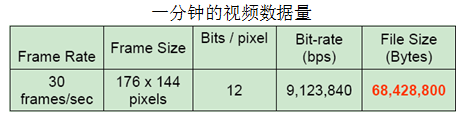
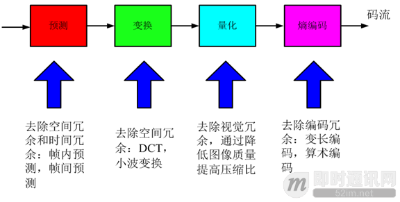
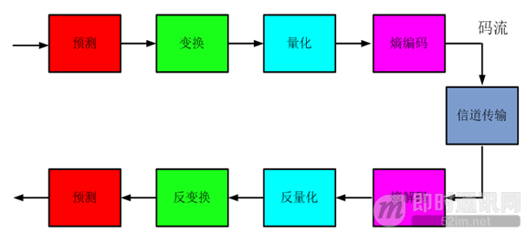

<!--
 * @Author: xiuquanxu
 * @Company: kaochong
 * @Date: 2020-12-30 14:34:29
 * @LastEditors: xiuquanxu
 * @LastEditTime: 2020-12-30 14:45:18
-->
### 视频为何要压缩  

先看一个原始视频：  
  

这是一分钟视频的数据量。  
30：代表一秒钟有30帧图片  
176 * 144：代表每个图片的宽和高是176 * 144  
12：代表每个像素点占12位（yuv:4:2:0）  
所以每分钟数组量就是：30 * 176 * 144 * 12 = 9123840  
（最后一个可以不看）计算过后为1.08M  

### 压缩  

1. 有损压缩：压缩前解压缩后图像不一致X≠X'，压缩比高(10:1~20:1)，利用人的视觉系统的特性。典型格式例如：MPEG-2，H.264/AVC，AVS
2. 无损压缩：压缩前、解压缩后图像完全一致，压缩比低(2:1~3:1)。典型格式例如：Winzip，JPEG-LS。  

### 编解码过程  
编码：  
  

解码：  
  
