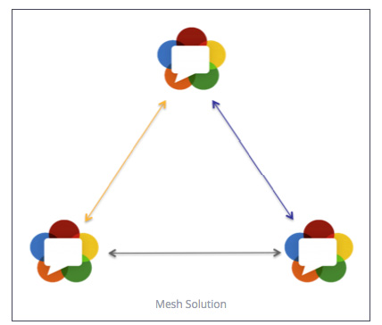
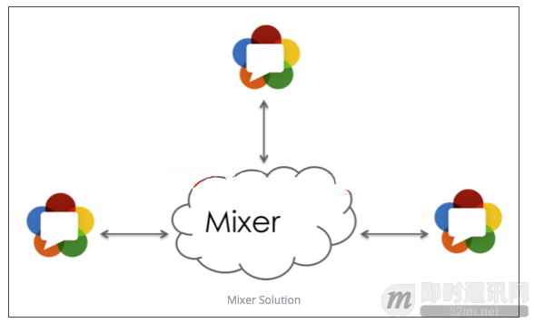
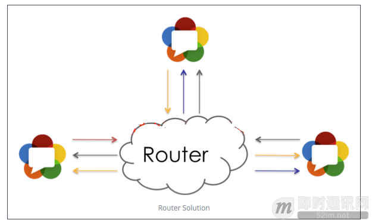

<!--
 * @Author: xiuquanxu
 * @Company: kaochong
 * @Date: 2020-12-30 20:04:32
 * @LastEditors: xiuquanxu
 * @LastEditTime: 2020-12-30 20:09:07
-->
### 多媒体架构  

### 1  
  

使用webrtc点对点进行连接

优点：webrtc直接peer to peer，服务端几乎没有压力  
缺点：对于端上压力较大  

### 2
  

服务端进行混音等操作  

优点：端上压力较小  
缺点：服务端压力较大，所有混音编解码工作都在服务端  

### 3 
  

该方案最大特点就是服务端只负责包转发，不负责转码，yy流媒体服务基本上就是这个功能。  

优点：与Mixer相比服务端压力比较小，而且容易扩展。
缺点：考虑到不同客户端需要不同的接收能力，所以真正实现下来服务端的架构也并不简单。
