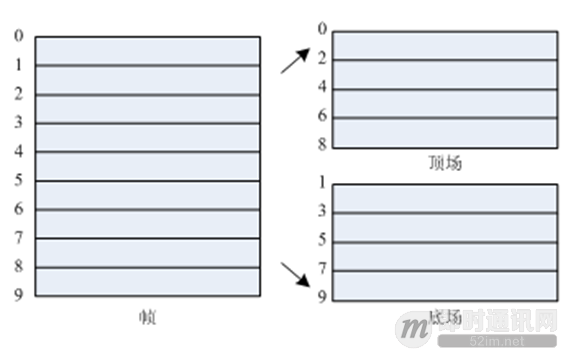
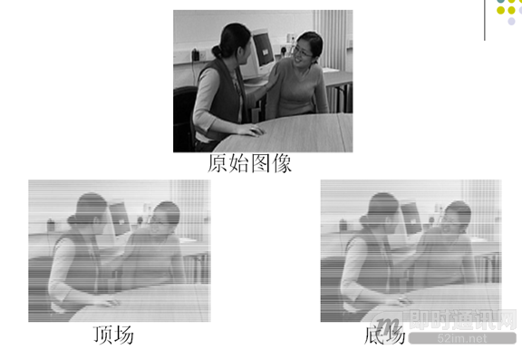

<!--
 * @Author: xiuquanxu
 * @Company: kaochong
 * @Date: 2020-12-30 16:24:09
 * @LastEditors: xiuquanxu
 * @LastEditTime: 2020-12-30 18:39:14
-->
### 什么是数字视频  

数字视频可以理解为：自然场景上对时间和空间的数字采样  

1. 空间采样的主要技术指标为：解析度（Resolution），也就是w和h  
2. 时间采样的主要技术指标为：帧率（帧/秒）  

### 人类视觉(HVS)  

HVS构成：  
1. 眼睛
2. 神经
3. 大脑  

HVS特点：  
1. 对亮度特别敏感  
2. 对色度敏感度低于亮度
3. 对运动信息敏感
4. 对高频信息不敏感  

### 针对于HVS特点视觉系统设计特点  
1. 因为对亮度感知强，对色度感知弱，所以我们可以降低对色度信息的记录，  
2. 丢弃高频信息，只编码低频信息

### 什么是RGB色彩空间  
RGB分别代表Red，Green，Blue，任何颜色都可以通过这三种颜色混合生成。  
  

### YUV色彩空间  

Y代表亮度，UV代表色度  

为什么是YUV？  
第一YUV中Y代表亮度可以把人类视觉感受强烈的部分表达完整，UV表示色度可以弱化表达，达到更好的压缩效果。第二老的电视电视机没有色度只有黑白亮度，所以YUV也可以兼容老电视机。第三点YUV传输过程中数据量要小，举例，如果传输一个1000*1000的图片，通过rgb形式大小为：(8 + 8 + 8) * 1000 * 1000 / 1024 / 1024 = 22M，如果是yuv（4：2：0为例）形式存储大小为：(4 + 1 + 1) * 1000 * 1000 / 1024 / 1024 = 15M，这里可以看出来节约了7M。理论上rgb是yuv（8 + 8 + 8） / (8 + 2 + 2) = 1.5倍

YUV分类有哪些？  
1. YUV(4:4:4): 一个Y元素对应一个U元素和一个V元素
2. YUV(4:2:2): 两个Y元素共用一个U元素和一个V元素
3. YUV(4:2:0其实叫4:1:1): 四个Y元素共用一个U元素和一个V元素  

YUV420按存储的方式又可以分为YU12、YU21、NV12、NV21。  
？？？ & 为什么没有B帧

### RGB和YUV转换  
y = k1R + k2G + k3B  

根据大量实践经验值：k1 = 0.29; k2 = 0.587; k3=0.114  
主流的编解码器标准压缩对象都是YUV
### 一张图像包括两场（顶场和底场）  

  

